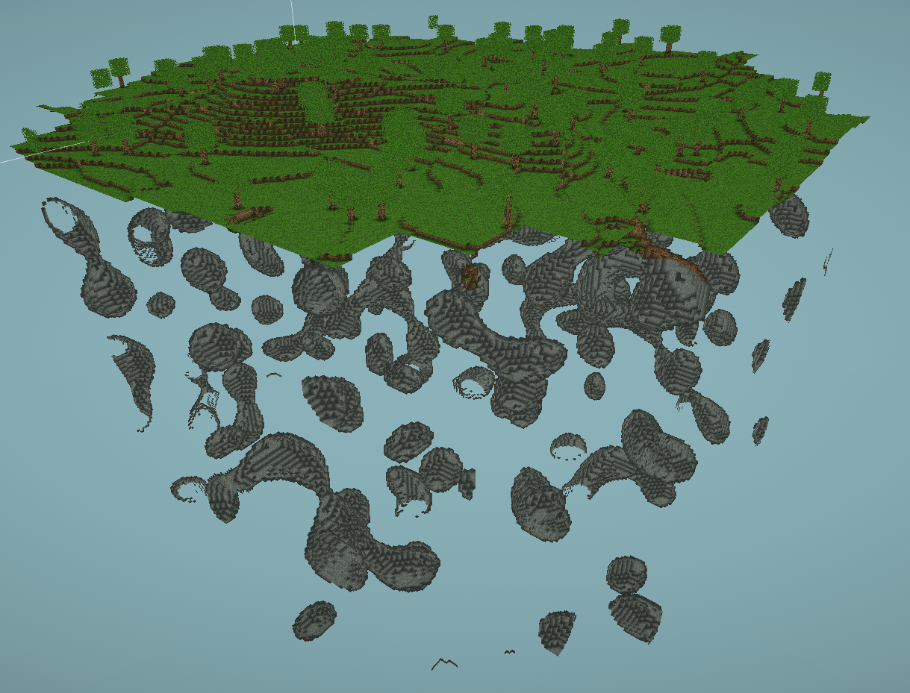

# VoxelGame

> Minecraft clone in Unity with implemented SSAO and serialization.

## :hammer: Generation



Procedural Generation of:

```sh
Terrain, Caves, Trees
```

## :clipboard: Meta

Spartak Gevorgyan – artak10t@gmail.com

Distributed under the GNU General Public License v3.0 license. See ``GNU General Public License v3.0`` for more information.

[https://github.com/artak10t/github-link](https://github.com/artak10t/)
